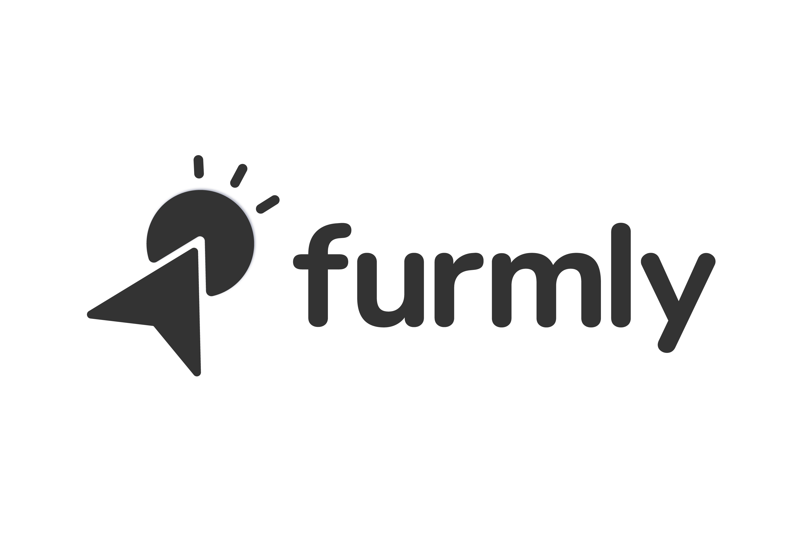

<p align="center">
  
  <br>
  <br>
</p>

<p align="center">
<a href="http://opensource.org/licenses/MIT"></a>
</p>


## What it does
Furmly studio is the development environment for creating and administrating furmly apps. Furmly apps are driven by [Furmly-server](https://github.com/furmly/furmly-server)

## What its built with
* Electron
* React
* [React-Storm-Diagrams](https://github.com/projectstorm/react-diagrams)
* [Furmly-Base-Web](https://github.com/furmly/furmly-base-web) (simple implementation of standard furmly controls)
  
## How to Install
Download the latest [release](./releases) and run the installer.

## Build from source
Clone this repo 

```git clone https://github.com/furmly/furmly-studio```

and run the command below:-

```npm install```

Start the application using:

```npm start```

## TODO
* Unit Tests
* Version Control/Migrations to allow several devs work on the same projects at the same time.
* Better Documentation

### License

MIT © [Onuekwusi Chidi](https://chidionuekwusi.com).
